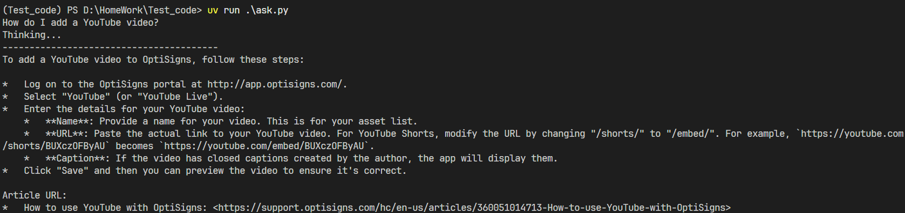

# Delta Knowledge Pipeline

This repository contains a stateless, automated pipeline that scrapes Help Center articles and synchronizes them to a Google Gemini File Search Store (Vector Database). It is designed for deployment as a scheduled daily job (e.g., via DigitalOcean App Platform or a standard Cron job).

## Setup Instructions

1. Clone the repository:
   ```bash
   git clone https://github.com/lehongquang1502/home_test.git
   cd home_test
   ```

2. Configure Environment Variables:
   Rename the provided `.env.sample` file to `.env` and configure your API key:
   ```bash
   GEMINI_API_KEY="your_actual_api_key_here"
   ```

## Execution Guide

### Local Execution (Python via uv)
Ensure Python 3.11+ is installed. We recommend utilizing `uv` for efficient dependency management.
```bash
# Install system dependencies
uv pip install --system requests markdownify python-dotenv google-genai

# Execute the synchronization pipeline
uv run main.py
```

### Containerized Execution (Docker)
To replicate the target cloud deployment environment, the application can be run via Docker. Note that the `.env` file is intentionally excluded from the build context for security purposes. Environment variables must be injected at runtime.

```bash
# 1. Build the Docker image
docker build -t scraper-app .

# 2. Run the container with injected credentials
docker run -e API_KEY="your_actual_api_key_here" scraper-app
```
The container will execute the pipeline once, output the synchronization summary, and terminate gracefully with an exit code of 0.

## Chunking Strategy

During the synchronization phase to the Gemini Vector Database, chunking is delegated to Google's server-side engine via the `white_space_config`:
- `max_tokens_per_chunk`: 500
- `max_overlap_tokens`: 50

**Rationale:** The source Help Center articles are highly structured, predominantly consisting of step-by-step instructions and bullet points. A 500-token limit provides a sufficient context window to encapsulate a complete troubleshooting step or feature description, thereby preventing context fragmentation. The 50-token overlap ensures that semantic context is preserved across chunk boundaries, providing the optimal retrieval context for the RAG agent to synthesize accurate responses.

## Daily Job Logs

The application is configured for deployment as a Scheduled Job on DigitalOcean. 
Live execution logs can be monitored here: [DigitalOcean App Platform Logs] *(Update with the actual URL upon deployment)*.

## Assistant Verification

Below is a demonstration of the integrated assistant successfully querying the Vector Store to answer the sample question: "How do I add a YouTube video?"

